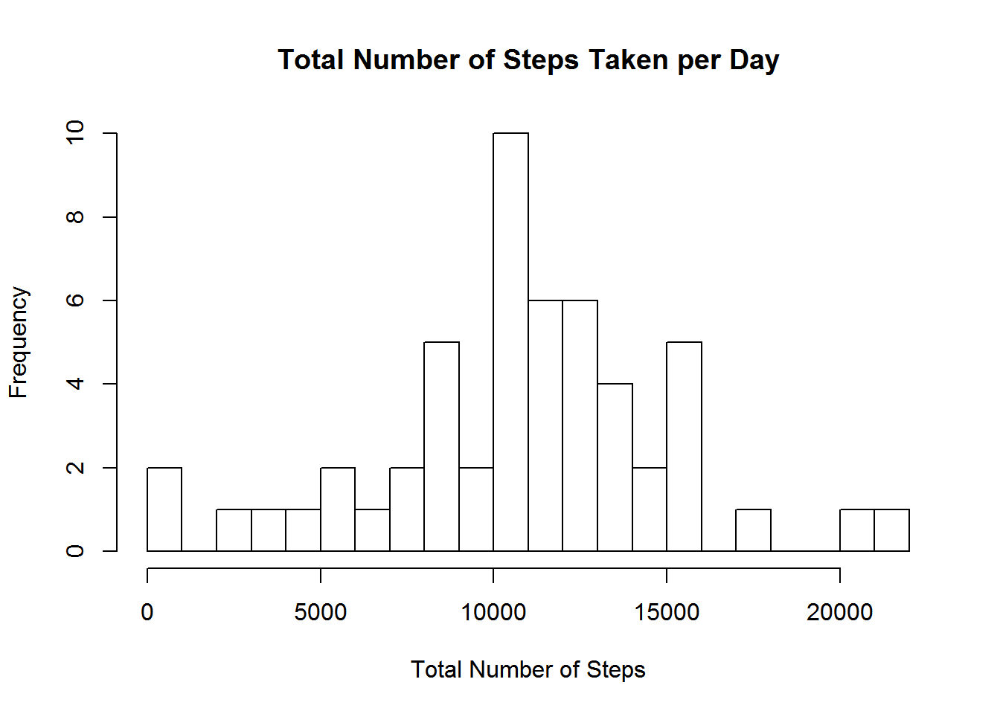

Introduction
------------

### Loading and preprocessing the data

1.  Load in the data.
2.  Process/transform the data (if necessary) into a format suitable for
    your analysis.

<!-- -->

    # Load in the data.
    activity_data <- read.csv("activity.csv")

    # Convert the date column (which is currently of the factor class) to the date class.
    activity_data$date <- as.Date(activity_data$date, format="%Y-%m-%d")

### What is mean total number of steps taken per day?

1.  Calculate the total number of steps taken per day.

<!-- -->

    steps_per_day <- aggregate(steps ~ date, data = activity_data, sum, na.rm = TRUE)
    steps_per_day

    ##          date steps
    ## 1  2012-10-02   126
    ## 2  2012-10-03 11352
    ## 3  2012-10-04 12116
    ## 4  2012-10-05 13294
    ## 5  2012-10-06 15420
    ## 6  2012-10-07 11015
    ## 7  2012-10-09 12811
    ## 8  2012-10-10  9900
    ## 9  2012-10-11 10304
    ## 10 2012-10-12 17382
    ## 11 2012-10-13 12426
    ## 12 2012-10-14 15098
    ## 13 2012-10-15 10139
    ## 14 2012-10-16 15084
    ## 15 2012-10-17 13452
    ## 16 2012-10-18 10056
    ## 17 2012-10-19 11829
    ## 18 2012-10-20 10395
    ## 19 2012-10-21  8821
    ## 20 2012-10-22 13460
    ## 21 2012-10-23  8918
    ## 22 2012-10-24  8355
    ## 23 2012-10-25  2492
    ## 24 2012-10-26  6778
    ## 25 2012-10-27 10119
    ## 26 2012-10-28 11458
    ## 27 2012-10-29  5018
    ## 28 2012-10-30  9819
    ## 29 2012-10-31 15414
    ## 30 2012-11-02 10600
    ## 31 2012-11-03 10571
    ## 32 2012-11-05 10439
    ## 33 2012-11-06  8334
    ## 34 2012-11-07 12883
    ## 35 2012-11-08  3219
    ## 36 2012-11-11 12608
    ## 37 2012-11-12 10765
    ## 38 2012-11-13  7336
    ## 39 2012-11-15    41
    ## 40 2012-11-16  5441
    ## 41 2012-11-17 14339
    ## 42 2012-11-18 15110
    ## 43 2012-11-19  8841
    ## 44 2012-11-20  4472
    ## 45 2012-11-21 12787
    ## 46 2012-11-22 20427
    ## 47 2012-11-23 21194
    ## 48 2012-11-24 14478
    ## 49 2012-11-25 11834
    ## 50 2012-11-26 11162
    ## 51 2012-11-27 13646
    ## 52 2012-11-28 10183
    ## 53 2012-11-29  7047

1.  Make a histogram of the total number of steps taken each day.

<!-- -->

    hist(steps_per_day$steps, breaks = 20, main = "Total Number of Steps Taken per Day", xlab = 'Total Number of Steps')

3.1. Calculate the mean number of steps taken per day.

    mean_steps <- mean(steps_per_day$steps, na.rm = TRUE)
    mean_steps

    ## [1] 10766.19

The mean number of steps taken per day is 10766.

3.2. Now calculate the median number of steps taken per day.

    median_steps <- median(steps_per_day$steps, na.rm = TRUE)
    median_steps

    ## [1] 10765

The median number of steps taken per day is 10765.

### What is the average daily activity pattern?

1.  Make a time series plot (i.e. type = "l") of the 5-minute
    interval (x-axis) and the average number of steps taken, averaged
    across all days (y-axis).

<!-- -->

    steps_interval <- aggregate(steps ~ interval, data = activity_data, mean, na.rm = TRUE)
    plot(steps ~ interval, data = steps_interval, type = "l", main = 'Average Number of Steps by Time Interval', xlab = 'Time Interval', ylab = 'Average Number of Steps')

1.  Which 5-minute interval, on average across all the days in the
    dataset, contains the maximum number of steps?

<!-- -->

    steps_interval[which.max(steps_interval$steps),]$interval

    ## [1] 835

The 835th interval contains the maximum number of steps.

### Imputing missing values

1.  Calculate and report the total number of missing values in the
    dataset (i.e. the total number of rows with NAs)

<!-- -->

    missing_values <- sum(!complete.cases(activity_data))
    missing_values

    ## [1] 2304

The total number of missing values in the dataset is 2304.

1.  Devise a strategy for filling in all of the missing values in
    the dataset. The strategy does not need to be sophisticated. For
    example, you could use the mean/median for that day, or the mean for
    that 5-minute interval, etc.

For filling in all of the missing values in the original dataset, we
will use the mean of that 5-minute interval. We will bind the original
data set with our steps per interval dataset, and use the mean number of
steps for a 5-minute interval to fill the missing values.

1.  Create a new dataset that is equal to the original dataset but with
    the missing data filled in.

We will bind the original data set with our steps per interval dataset,
and use the mean number of steps for a 5-minute interval to fill the
missing values.

    new_activity_data <- cbind(activity_data, steps_interval[,2])
    colnames(new_activity_data)[4] <- c("mean_interval_steps")
    new_activity_data$steps <- ifelse(is.na(new_activity_data$steps), new_activity_data$mean_interval_steps, new_activity_data$steps)

4.1. Make a histogram of the total number of steps taken each day.

    new_steps_per_day <- aggregate(steps ~ date, data = new_activity_data, sum, na.rm = TRUE)
    hist(new_steps_per_day$steps, breaks = 20, main = "Total Number of Steps Taken per Day", xlab = 'Total Number of Steps')

4.2. Calculate and report the mean and median total number of steps
taken per day.

    new_mean_steps <- mean(new_steps_per_day$steps, na.rm = TRUE)
    new_mean_steps

    ## [1] 10766.19

    new_median_steps <- median(new_steps_per_day$steps, na.rm = TRUE)
    new_median_steps

    ## [1] 10766.19

Both the mean and median total number of steps taken per day are now
10766.

4.3 and 4.4. Do these values differ from the estimates from the first
part of the assignment? What is the impact of imputing missing data on
the estimates of the total daily number of steps?

The mean number of steps taken per day remains the same at 10766 steps.
This is expected as the missing values were replaced with their
appropriate 5-minute interval means.

The median number of steps is now slightly different, 10766 vs. the
original 10765, and closer to the mean. This is also expected given the
method of replacement we chose.

### Are there differences in activity patterns between weekdays and weekends?

1.  Create a new factor variable in the dataset with two levels -
    "weekday" and "weekend" indicating whether a given date is a weekday
    or weekend day.

<!-- -->

    # Create a new column that assigns each date the appropriate day of the week.
    new_activity_data$Day <- weekdays(new_activity_data$date)

    # Write a function to assign "weekday" and "weekend" to each day of the week.
    day_of_week = function(day){
      if(day %in% c('Saturday', 'Sunday')){
        return('weekend')
      } else
        return('weekday')
    }

    # Apply the function to the dataset.
    new_activity_data$Weekday_or_Weekend = as.factor(apply(as.matrix(new_activity_data$Day), 1, day_of_week))

1.  Make a panel plot containing a time series plot (i.e. type = "l") of
    the 5-minute interval (x-axis) and the average number of steps
    taken, averaged across all weekday days or weekend days (y-axis).

<!-- -->

    library(lattice)
    new_steps_interval <- aggregate(steps ~ interval + Weekday_or_Weekend, data = new_activity_data, mean, na.rm = TRUE)

    xyplot(steps ~ interval | factor(Weekday_or_Weekend), data = new_steps_interval, xlab = "Time Interval", ylab = "Average Number of Steps Taken", layout = c(1,2))

